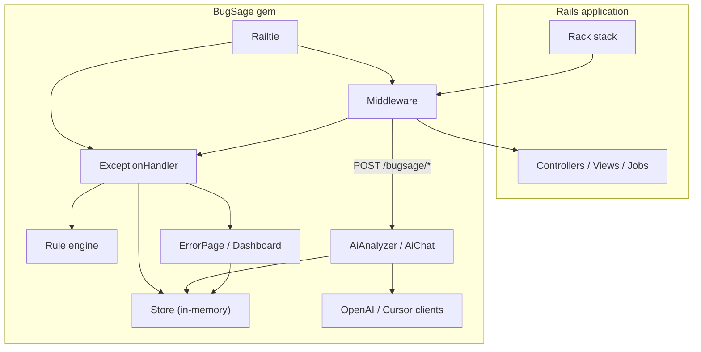
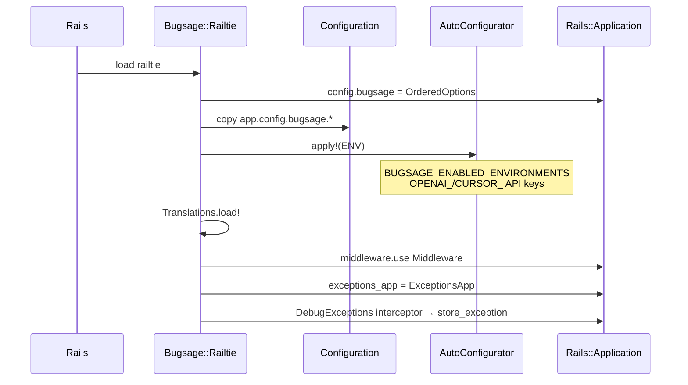
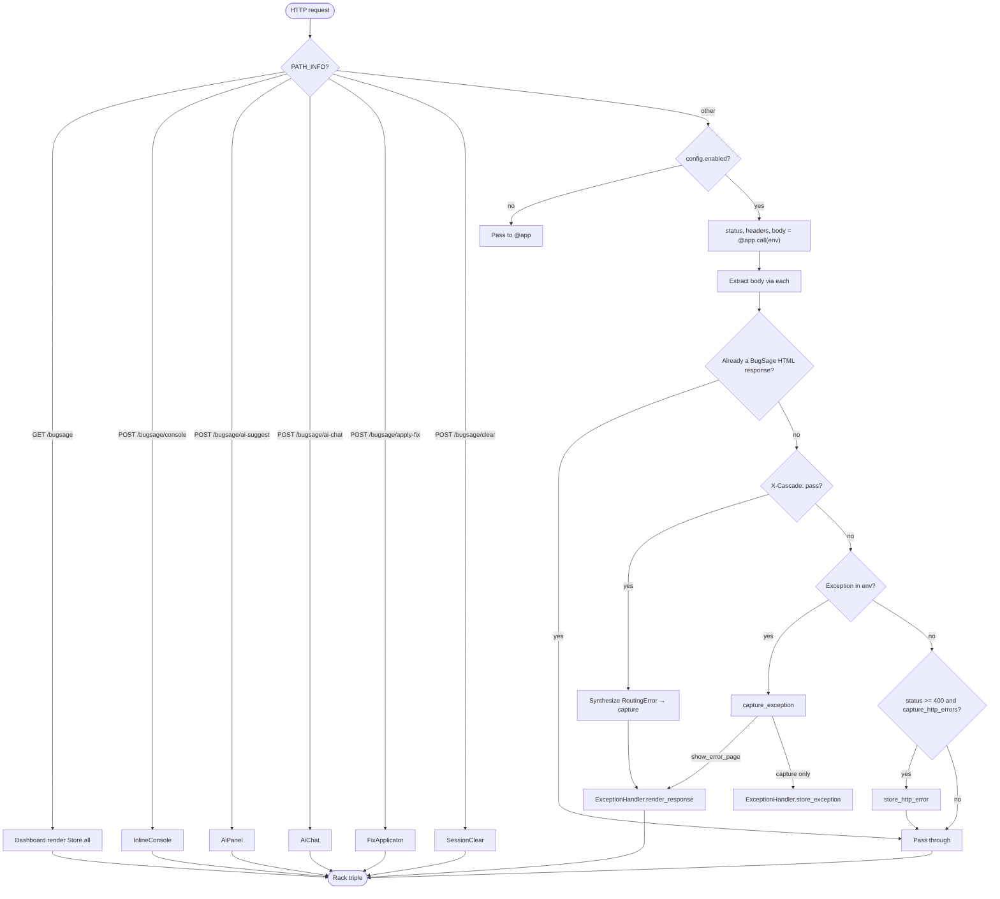
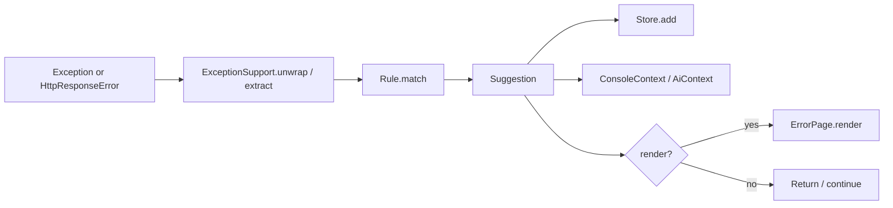
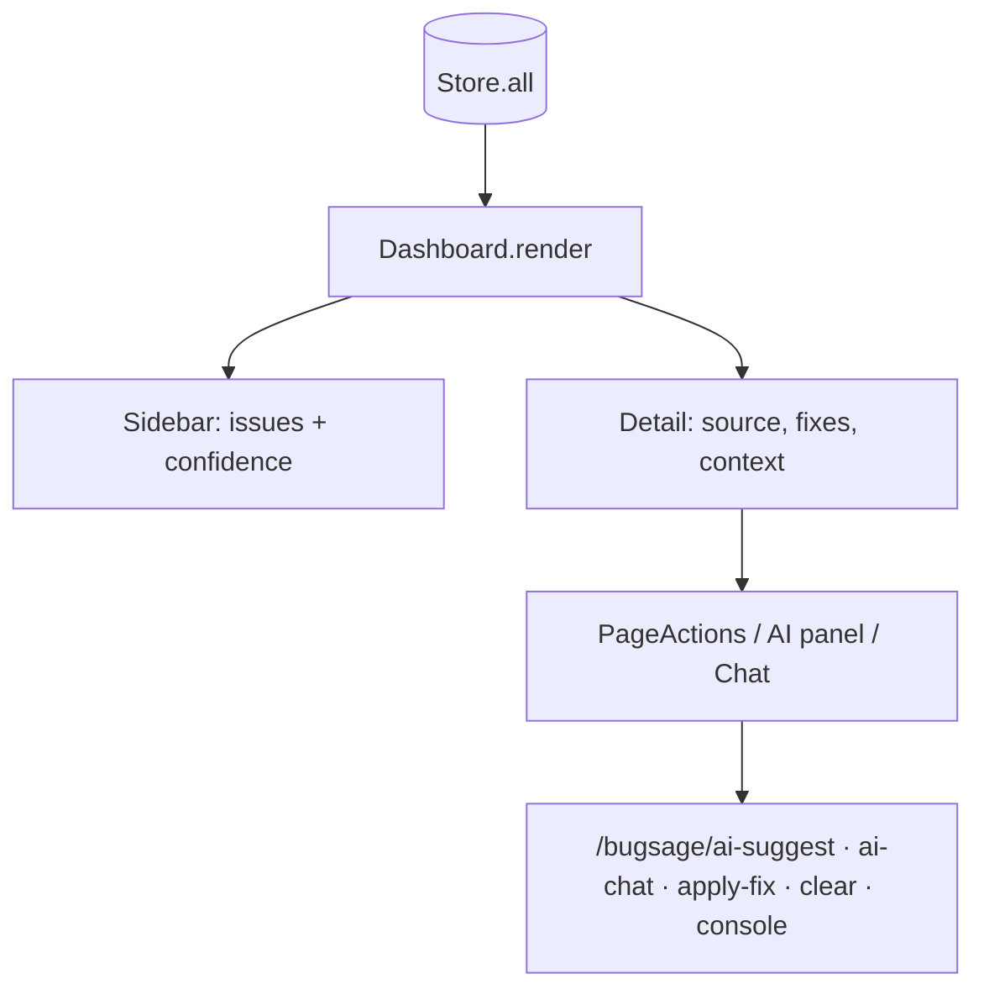
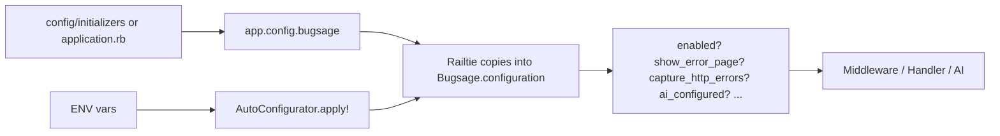
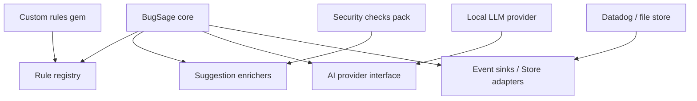
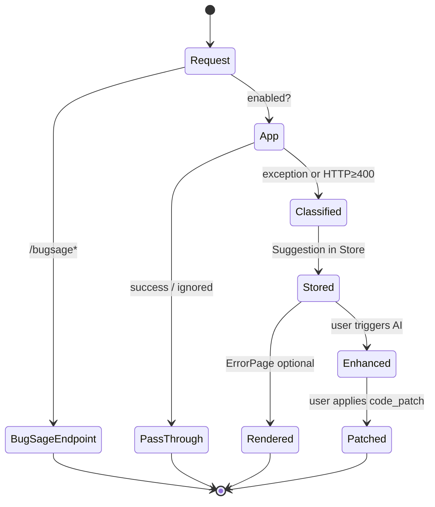

# Architecture

This document describes how BugSage is structured inside a Rails application: boot wiring, request flow, exception classification, AI enhancement, and the session dashboard.

Related docs: [ROADMAP.md](ROADMAP.md) · [docs/Configuration.md](docs/Configuration.md) · [docs/AI.md](docs/AI.md) · [CONTRIBUTING.md](CONTRIBUTING.md)

---

## Overall architecture

BugSage is a **development-oriented Rack middleware + Railtie** gem. It does not replace your application logic. It observes failures at the Rack/Rails boundary, classifies them with a deterministic rule engine, stores session events in memory, and optionally refines suggestions with an external AI provider **on demand**.



**Design principles**

| Principle | How it shows up |
|-----------|-----------------|
| Rules first | `Rule.match` always runs before AI |
| Zero-config | `Bugsage::Railtie` inserts middleware and `exceptions_app` |
| Safe writes | `FixApplicator` limited to development/test |
| Opt-in AI | Provider called only via Quick Fix / Chat endpoints |
| Pass-through HTTP | API 4xx/5xx bodies are captured without replacing the client response |

---

## Folder structure

```text
lib/
  bugsage.rb                 # gem entry: requires, Bugsage.configure / .t
  bugsage/
    railtie.rb               # Rails boot hooks
    configuration.rb         # settings + predicates
    auto_configurator.rb     # env-based defaults (keys, environments)
    middleware.rb            # Rack entry + /bugsage routes
    exception_handler.rb     # classify → store → optionally render
    exceptions_app.rb        # Rails exceptions_app adapter
    exception_support.rb     # unwrap / extract exceptions from env
    rule.rb                  # deterministic classification
    suggestion.rb            # suggestion value object
    store.rb                 # in-memory session event list
    http_error_capture.rb    # HTTP ≥ 400 → HttpResponseError
    http_response_error.rb
    error_page.rb            # HTML error page
    dashboard.rb             # HTML session dashboard
    inline_console.rb        # POST /bugsage/console
    ai_panel.rb              # POST /bugsage/ai-suggest + UI panel
    ai_chat.rb               # POST /bugsage/ai-chat
    ai_analyzer.rb           # AI prompt + merge into Suggestion
    ai_context.rb            # request-scoped AI context
    openai_client.rb
    cursor_client.rb
    code_patch.rb            # surgical patch model
    fix_applicator.rb        # POST /bugsage/apply-fix
    page_actions.rb          # dashboard/error action UI
    editor_links.rb          # Cursor / VS Code deep links
    code_context.rb          # source frames + HTML helpers
    trace_cleaner.rb         # filter framework frames
    translations.rb          # Bugsage.t + locale loading
    locales/en.yml
    formatter.rb             # terminal formatter (CLI)
    cli.rb / installation.rb / installer.rb
  generators/bugsage/install/
exe/bugsage
docs/
spec/
```

Runtime assets shipped in the gem are primarily under `lib/bugsage/` (plus `exe/` and docs when packaged).

---

## Main components

| Component | Responsibility |
|-----------|----------------|
| **`Railtie`** | Register config, middleware, `exceptions_app`, debug interceptor, i18n |
| **`Middleware`** | Serve BugSage endpoints; wrap `@app.call`; capture exceptions / HTTP errors |
| **`ExceptionsApp`** | Handle Rails-routed exception responses (`/404`, etc.) |
| **`ExceptionHandler`** | Orchestrate extract → `Rule.match` → `Store` → render |
| **`Rule`** | Map exception classes/messages to `Suggestion` |
| **`Suggestion`** | Issue, location, root cause, fixes, confidence, optional `code_patch` |
| **`Store`** | Process-local ring buffer of session events (max 100) |
| **`HttpErrorCapture`** | Build synthetic `HttpResponseError` from status + body |
| **`ErrorPage` / `Dashboard`** | HTML UIs over a suggestion or `Store.all` |
| **`AiPanel` / `AiChat` / `AiAnalyzer`** | On-demand AI enhancement and chat refinement |
| **`CodePatch` / `FixApplicator`** | Parse, preview, and apply surgical edits |
| **`Configuration` / `AutoConfigurator`** | Explicit + env-driven settings |
| **`JsonEndpoint` / `RequestContext` / `AiSupport`** | Shared Rack JSON, request context, and AI helpers |
| **`Translations`** | Locale YAML and `Bugsage.t` |

---

## Railtie initialization

When Rails boots and the gem is loaded (`require "bugsage"` loads the Railtie if `Rails::Railtie` is defined), BugSage registers several initializers:



### Initializers (in order of intent)

1. **`bugsage.configuration`** — Copy `config.bugsage` options into `Bugsage.configuration`, then run `AutoConfigurator.apply!`
2. **`bugsage.i18n`** — Load `lib/bugsage/locales/*.yml`
3. **`bugsage.middleware`** — `app.config.middleware.use Bugsage::Middleware`
4. **`bugsage.exceptions_app`** — Preserve previous `exceptions_app` as fallback; set `Bugsage::ExceptionsApp`
5. **`bugsage.debug_interceptor`** — When Rails debug exceptions fire, silently `store_exception` if capture is enabled

No `routes.rb` changes are required: BugSage endpoints are handled inside the middleware by path/method matching.

---

## Middleware flow

`Bugsage::Middleware#call` is the primary runtime entry point.



### Body handling

Rails API responses often use `ActionDispatch::Response::RackBody`, which implements `each` but not `map`. Middleware collects parts with `each`, closes the original body, then returns a new array body so capture and pass-through remain safe.

### Capture modes

| Mode | When | Outcome |
|------|------|---------|
| Render error page | `show_error_page?` (default: development) | Replace response with BugSage HTML |
| Store only | `capture_errors?` without show page (for example test) | Keep Rails response; add `Store` event |
| HTTP capture | status ≥ 400, no exception, not a BugSage path | Store `HttpResponseError`; **preserve** original body |
| Disabled | env not in `enabled_environments` | Middleware no-ops after endpoint short-circuits |

---

## Exception handling



### Pipeline (`ExceptionHandler.process`)

1. Ensure BugSage is `enabled?`
2. `ExceptionSupport.extract` / unwrap Rails wrappers
3. `Rule.match(exception)` → `Suggestion` (or bail)
4. Build request context from Rack env
5. `Store.add` when `capture_errors?`
6. Set console / AI context when those features are active
7. Optionally return `[status, headers, ErrorPage HTML]`

### Rules

`Rule::MATCHERS` is an ordered list of class (and optional message) definitions. More specific classes must appear before parents (for example `NoMethodError` before `NameError`). Unmatched exceptions receive a generic suggestion.

HTTP API failures become `Bugsage::HttpResponseError`, which has its own matcher/handler.

### Parallel entry: `ExceptionsApp`

Rails may invoke `config.exceptions_app` for routing and certain public exception flows. `ExceptionsApp` extracts the exception and delegates to `ExceptionHandler`, with a fallback to the previous exceptions app when BugSage does not handle the case.

### Debug interceptor

`ActionDispatch::DebugExceptions.register_interceptor` stores exceptions even when Rails is already rendering its own debug page—useful when capture is on but the BugSage HTML page is not replacing the response.

---

## AI integration

AI is **never** invoked automatically during exception render. Rendering stays rule-based; AI runs only when the UI posts to BugSage endpoints.

```mermaid
sequenceDiagram
  participant Browser
  participant MW as Middleware
  participant Panel as AiPanel / AiChat
  participant Analyzer as AiAnalyzer
  participant Client as OpenAiClient / CursorClient
  participant Store

  Browser->>MW: Exception → ErrorPage / Dashboard HTML
  Note over Browser,Store: Suggestion is rules-only; Store has event
  Browser->>MW: POST /bugsage/ai-suggest
  MW->>Panel: handle_request
  Panel->>Analyzer: enhance(suggestion, exception, context)
  Analyzer->>Client: complete(system, user)
  Client-->>Analyzer: JSON (+ code_patch)
  Analyzer-->>Panel: hybrid Suggestion
  Panel->>Store: update_at(index)
  Panel-->>Browser: JSON fixes / patch preview

  Browser->>MW: POST /bugsage/ai-chat
  MW->>Panel: AiChat.handle_request
  Panel->>Client: chat(...)
  Panel->>Store: persist refined code_patch
  Panel-->>Browser: reply + code_patch

  Browser->>MW: POST /bugsage/apply-fix
  Note over MW: FixApplicator (dev/test only)
```

### Components

| Piece | Role |
|-------|------|
| `AiContext` | Holds last exception/suggestion for the page or dashboard row |
| `AiPanel` | Quick Fix endpoint + embedded panel UI/JS |
| `AiChat` | Follow-up chat; may return updated `code_patch` |
| `AiAnalyzer` | Builds prompts, calls client, merges into `Suggestion` |
| `OpenAiClient` / `CursorClient` | HTTP providers (`CursorClient` polls Cloud Agents; longer timeout) |
| `CodePatch` | `delete_lines` / `replace_lines` / `insert_before` / `no_change` |

Provider selection: explicit `ai_provider`, else key prefix (`crsr_` → Cursor, otherwise OpenAI). See [docs/AI.md](docs/AI.md).

---

## Dashboard

The dashboard is an HTML UI rendered by `Dashboard.render(Store.all)` for `GET /bugsage`.



**Characteristics**

- In-memory, per Rails process (cleared on restart)
- Newest events first; capped at `Store::MAX_ENTRIES` (100)
- Includes both raised exceptions and captured HTTP errors
- Fix actions (apply patch, open editor, clear) are dashboard-centric; the full-page error view focuses on analysis + console + AI panel

---

## Configuration

Configuration is a plain Ruby object (`Bugsage::Configuration`) accessed via:

```ruby
Bugsage.configure { |config| ... }
# or Rails
Rails.application.configure do |config|
  config.bugsage.ai_enabled = true
end
```



Important env knobs:

- `BUGSAGE_ENABLED_ENVIRONMENTS`
- `OPENAI_API_KEY` / `BUGSAGE_OPENAI_API_KEY`
- `CURSOR_API_KEY` / `BUGSAGE_CURSOR_API_KEY`

Full option table: [docs/Configuration.md](docs/Configuration.md).

---

## Future plugin architecture

BugSage does not yet ship a formal plugin API. The roadmap targets a small, stable extension surface that preserves **rules first**.

### Intended extension points (v0.5 → v2.0)



| Hook | Purpose | Compatibility goal |
|------|---------|-------------------|
| **Rule registry** | Register matchers without editing `rule.rb` | Same `Suggestion` shape |
| **AI provider interface** | `#complete` / `#chat` like existing clients | Drop-in via `config.ai_client` (already partially supported) |
| **Enrichers** | Post-process suggestions (security/performance notes) | Pure functions; no Rack coupling |
| **Store adapters** | Persist beyond process memory | Implement `add` / `all` / `update_at` / `clear!` |
| **Event filters** | Skip capture for paths/statuses | Called from middleware before store |

### Near-term approach (before a formal API)

Until plugins land:

1. Prefer contributing rules upstream with specs
2. Use `config.ai_client` for alternate providers in tests or private apps
3. Keep host-app overrides in an initializer rather than monkey-patching middleware

Design constraints for future plugins:

- Must not auto-call AI on every exception
- Must not enable production writing of patches by default
- Must document whether they change zero-config defaults

See [ROADMAP.md](ROADMAP.md) for milestone placement.

---

## Request & data lifecycle (summary)



---

## Key files cheat sheet

| Concern | Start here |
|---------|------------|
| Boot | `lib/bugsage/railtie.rb` |
| Request flow | `lib/bugsage/middleware.rb` |
| Classify / render / store | `lib/bugsage/exception_handler.rb`, `rule.rb` |
| HTTP capture | `http_error_capture.rb` |
| UI | `error_page.rb`, `dashboard.rb` |
| AI | `ai_panel.rb`, `ai_chat.rb`, `ai_analyzer.rb` |
| Patches | `code_patch.rb`, `fix_applicator.rb` |
| Settings | `configuration.rb`, `auto_configurator.rb` |

---

*This architecture reflects BugSage v0.2.x. Update this document when boot wiring, store persistence, or the plugin API changes.*
