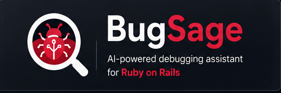
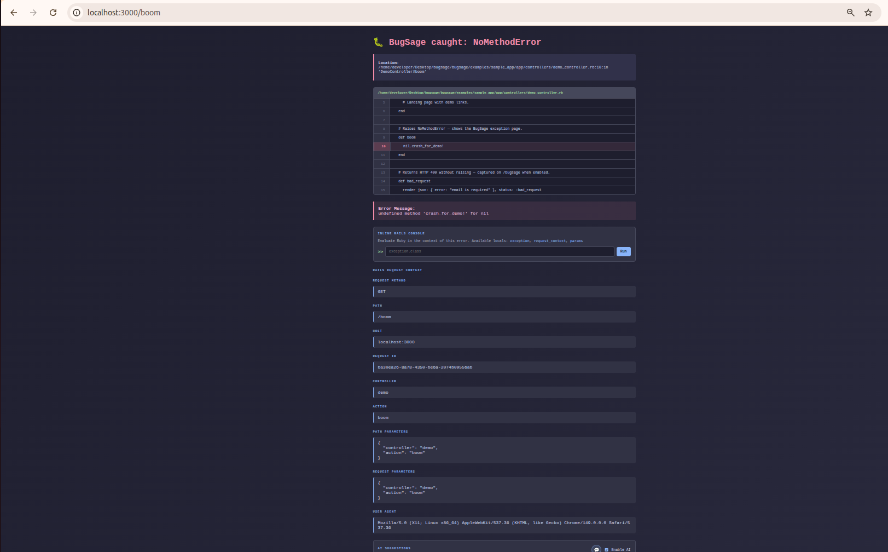
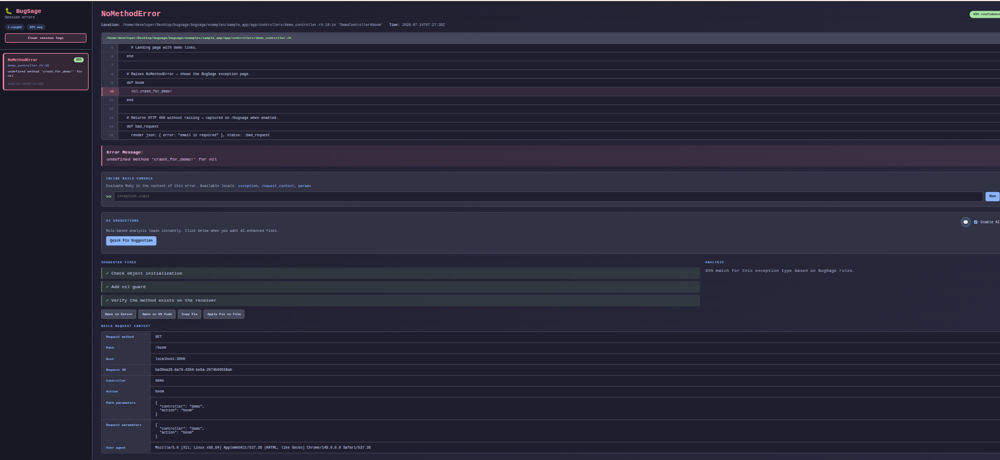
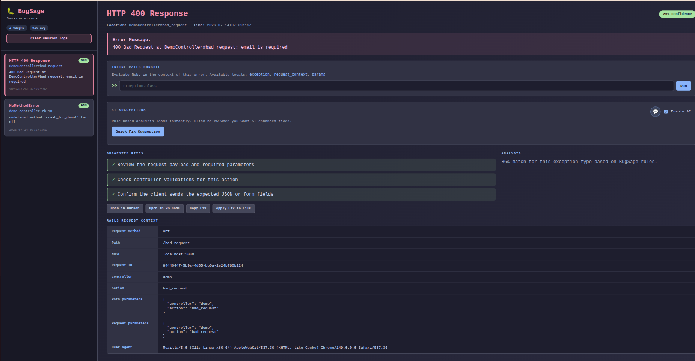
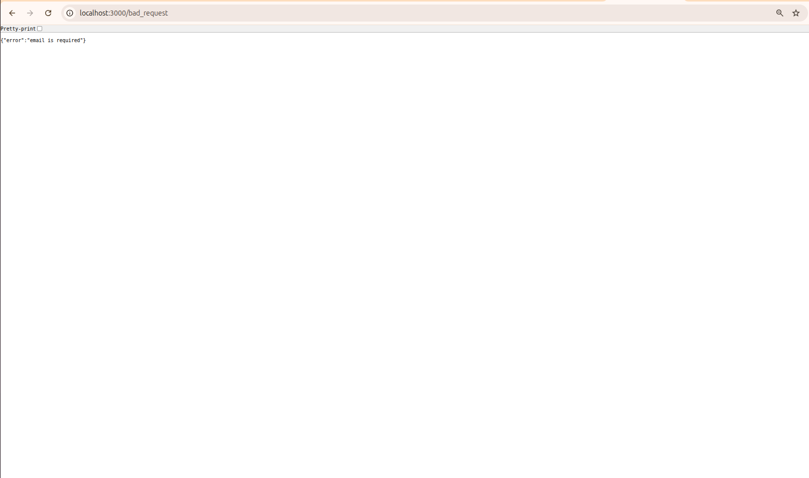

<p align="center">
  
</p>

# BugSage

[](https://github.com/MONARCHKOLI/bugsage/actions/workflows/ci.yml)

BugSage is a Ruby gem for Ruby on Rails applications that helps developers understand exceptions faster. Instead of showing only a raw stack trace, BugSage classifies the error, explains the likely root cause, and suggests actionable fixes.

It uses deterministic rules first, with optional AI-powered refinement when enabled.

## What BugSage does

- Catches common Rails and Ruby exceptions
- Classifies them into likely issue categories
- Surfaces the root cause in a simple report
- Suggests practical next steps
- Optionally refines suggestions with OpenAI or Cursor when configured
- Displays Rails request context such as path, method, controller, action, and parameters
- Provides a session dashboard at `/bugsage` in development
- Lets you chat with AI about a fix and apply refined code patches directly to your codebase

## Screenshots









## Installation

### Quick start (zero-config)

**1. Add the gem to your Gemfile**

```ruby
gem "bugsage"
```

**2. Install dependencies**

```bash
bundle install
```

**3. Start your Rails server**

```bash
bin/rails server
```

**4. Trigger an error in development**

Visit any route that raises an exception. You should see the BugSage error page.

**5. Open the session dashboard**

```text
http://localhost:3000/bugsage
```

No `routes.rb` changes, no middleware setup, and no `application.rb` edits are required. BugSage auto-wires everything through its Rails Railtie.

### What gets auto-wired on boot

- Exception capture middleware
- BugSage HTML error pages in development
- Session dashboard at `/bugsage`
- Inline Rails console at `/bugsage/console`
- On-demand AI panel with Quick Fix, loading animation, and follow-up chat
- Surgical code patches (`delete_lines`, `replace_lines`, `insert_before`) with duplicate detection
- Dashboard fix actions (apply patch, open in editor, copy prompt, clear session)
- Routing error capture via `exceptions_app`
- AI provider auto-detection when API keys are present

### Optional steps

**Generate a commented initializer** (only if you want custom overrides):

```bash
bundle exec rails generate bugsage:install
```

Or print the install guide and create the initializer:

```bash
bundle exec bugsage install
```

Print the guide without writing files:

```bash
bundle exec bugsage install --guide-only
```

**Enable AI-enhanced suggestions** (optional):

```bash
export OPENAI_API_KEY=sk-your-openai-key-here
# or
export CURSOR_API_KEY=crsr_your-cursor-key-here
bin/rails server
```

BugSage auto-detects the provider from the key prefix (`sk-...` → OpenAI, `crsr_...` → Cursor).

**Control enabled environments** (optional):

```bash
export BUGSAGE_ENABLED_ENVIRONMENTS=development,test,staging
```

Defaults to `development` and `test`.

The canonical install steps live in `lib/bugsage/installation.rb` (`Bugsage::Installation`).

## Configuration

BugSage works with zero configuration. Override defaults only when needed in `config/initializers/bugsage.rb` or `config/application.rb`:

```ruby
# config/initializers/bugsage.rb
Rails.application.configure do |config|
  config.bugsage.enabled_environments = %i[development test staging]
  config.bugsage.ai_enabled = true
  config.bugsage.ai_provider = :cursor
end
```

You can also configure at runtime:

```ruby
Bugsage.configure do |config|
  config.ai_enabled = true
  config.openai_model = "gpt-4o-mini"
end
```

### Configuration options

| Option | Default | Description |
|--------|---------|-------------|
| `enabled_environments` | `development`, `test` | Environments where BugSage runs |
| `show_error_page` | `true` in development only | Replace errors with the BugSage HTML page |
| `show_dashboard` | `true` in development only | Serve the `/bugsage` session dashboard |
| `capture_errors` | `true` | Store caught errors in the in-memory session store |
| `ai_enabled` | auto (`true` when an API key is present) | Show the on-demand AI panel (does not auto-call the API) |
| `ai_provider` | auto-detected | `:openai` or `:cursor` (auto-detects `crsr_` keys) |
| `openai_api_key` | `nil` (falls back to env) | OpenAI API key (`sk-...`) |
| `openai_model` | `gpt-4o-mini` | Model used for OpenAI analysis |
| `openai_api_base` | `https://api.openai.com/v1` | OpenAI-compatible API base URL |
| `cursor_api_key` | `nil` (falls back to env) | Cursor API key (`crsr_...`) |
| `cursor_model` | `nil` (account default) | Cursor Cloud Agents model; omit to use your account default |
| `cursor_api_base` | `https://api.cursor.com` | Cursor API base URL |
| `ai_timeout` | `15` (`90` minimum for Cursor) | Request/poll timeout in seconds |
| `ai_client` | `nil` | Custom AI client (for testing or alternate providers) |

### Default behavior by environment

| Environment | Error page | Dashboard | Capture | AI (if enabled) |
|-------------|------------|-----------|---------|-----------------|
| **development** | BugSage page | `/bugsage` | Yes | Yes |
| **test** | Rails default | Off | Yes (silent) | Yes |
| **production** | Off (disabled) | Off | Off | Off |

Restart the Rails server after changing configuration.

### AI suggestions (on-demand)

When an API key is available, BugSage shows an **AI Suggestions** panel on the error page and `/bugsage` dashboard with:

- **Enable AI** toggle — turn AI requests on or off for your browser session (stored in `localStorage`)
- **Quick Fix Suggestion** button — calls the AI API only when you click it
- **Loading animation** — spinner, progress bar, and step messages while AI runs (especially helpful for Cursor’s longer responses)
- **💬 Chat** — follow-up conversation about the error, the suggested fix, or alternative approaches

This keeps error pages fast: rule-based analysis loads instantly, and AI runs only when you need it.

Flow:

1. BugSage classifies the error with deterministic rules (instant)
2. You click **Quick Fix Suggestion** when you want AI help
3. BugSage sends exception details, numbered source context, and request context to the configured provider
4. Fixes, confidence, AI notes, and a structured `code_patch` update in the page without a reload
5. Use **💬 Chat** to ask questions, request alternatives (e.g. comment out a line instead of deleting it), or refine the fix
6. When chat produces a new patch, the code preview and **Apply AI to Codebase** button update automatically

#### Structured code patches

AI responses include a surgical `code_patch` instead of blind string replacement:

| Action | Purpose |
|--------|---------|
| `delete_lines` | Remove stray/debug lines |
| `replace_lines` | Replace specific lines (e.g. comment out instead of delete) |
| `insert_before` | Insert new code before a line |
| `no_change` | File already contains the correct fix |

Patches use absolute line numbers from numbered source context (±20 lines around the error). BugSage rejects patches that would duplicate code already in the file and preserves indentation on apply.

#### Dashboard fix actions

After suggestions appear on the `/bugsage` dashboard, use the fix actions (dashboard only — no full-page reload):

- **Quick Fix Suggestion** — fetch AI analysis on demand
- **Apply AI to Codebase** — apply the current `code_patch` to your source file, then open it in Cursor or VS Code
- **Open in Cursor** / **Open in VS Code** — jump to the failing file and line
- **Copy Fix** — copy a prompt you can paste into your editor AI chat
- **Apply Fix to File** — insert a `# BUGSAGE:` comment above the failing line in development
- **Clear session logs** — wipe captured errors from the dashboard sidebar in place

Chat-refined patches are persisted in the session store, so **Apply AI to Codebase** always uses the latest patch from Quick Fix or chat.

#### BugSage API endpoints

BugSage registers these Rack endpoints automatically:

| Endpoint | Method | Purpose |
|----------|--------|---------|
| `/bugsage` | GET | Session dashboard |
| `/bugsage/console` | POST | Inline Rails console eval |
| `/bugsage/ai-suggest` | POST | On-demand Quick Fix AI enhancement |
| `/bugsage/ai-chat` | POST | Follow-up chat with optional `code_patch` updates |
| `/bugsage/apply-fix` | POST | Apply a `code_patch` to a source file (development/test only) |
| `/bugsage/clear` | POST | Clear session error store |

Disable AI entirely with `config.bugsage.ai_enabled = false`.

#### OpenAI

```bash
export OPENAI_API_KEY=sk-your-openai-key-here
bin/rails server
```

BugSage also reads `BUGSAGE_OPENAI_API_KEY`.

#### Cursor

If you only have a Cursor API key (`crsr_...`), BugSage can use the [Cursor Cloud Agents API](https://cursor.com/docs/cloud-agent/api/endpoints):

```bash
export CURSOR_API_KEY=crsr_your-cursor-key-here
bin/rails server
```

BugSage also reads `BUGSAGE_CURSOR_API_KEY`. If you already exported a Cursor key as `OPENAI_API_KEY`, BugSage auto-detects the `crsr_` prefix and routes to Cursor.

Optional explicit config:

```ruby
config.bugsage.ai_enabled = true
config.bugsage.ai_provider = :cursor
# config.bugsage.cursor_model = "composer-2.5"  # optional; omit for account default
```

**Note:** Cursor analysis runs through a Cloud Agent and may take up to 90 seconds on the first response. OpenAI responses are usually much faster.

The API key must be available in the **same terminal** that starts the Rails server.

When AI enhancement succeeds, the error page and dashboard show an **AI-enhanced** badge and **AI notes**. If the API fails (e.g. invalid key, rate limit), BugSage shows rule-based suggestions and logs:

```text
[BugSage] AI enhancement failed: ...
```

## Usage

When an exception is caught, BugSage renders a helpful page with:

- the exception name
- highlighted source code near the failure
- the message
- suggested fixes
- confidence score
- optional AI notes and code patch preview
- on-demand AI panel with loading animation and follow-up chat
- inline Rails console (development)
- Rails request context

Open the session dashboard at:

```text
http://localhost:3000/bugsage
```

## Supported exceptions

BugSage handles many common Ruby and Rails exceptions, including:

### Ruby
- `NoMethodError`, `NameError`, `KeyError`, `ArgumentError`, `TypeError`
- `ZeroDivisionError`, `JSON::ParserError`, `FrozenError`, `RuntimeError`

### Rails / Active Record
- `ActionController::RoutingError`, `ActionController::ParameterMissing`
- `ActionController::UnpermittedParameters`, `ActionView::Template::Error`
- `ActiveRecord::RecordNotFound`, `ActiveRecord::RecordInvalid`
- `ActiveRecord::RecordNotUnique`, `ActiveRecord::StatementInvalid`
- `ActiveRecord::ConnectionNotEstablished`, and more

### Generic fallback
Any other `StandardError` receives a generic BugSage suggestion.

## How and where to check logs

When BugSage catches an exception, inspect:

- the BugSage error page in the browser
- the `/bugsage` dashboard for session history
- `log/development.log` or the terminal running `bin/rails server`
- `[BugSage] AI enhancement failed` warnings when AI is enabled but the API call fails

## Development

After checking out the repo, run:

```bash
bundle install
bundle exec rspec
```

Try the minimal demo app:

```bash
cd examples/sample_app
bundle install
bin/rails server
```

See [examples/sample_app/README.md](examples/sample_app/README.md).

## Contributing

Bug reports and pull requests are welcome. See [CONTRIBUTING.md](CONTRIBUTING.md) for development guidelines, [ARCHITECTURE.md](ARCHITECTURE.md) for system design, and [ROADMAP.md](ROADMAP.md) for planned work.

## License

The gem is available as open source under the terms of the [MIT License](https://opensource.org/licenses/MIT).

